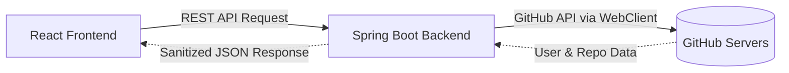

# GitHub Portfolio Analyzer

The **GitHub Portfolio Analyzer** is a full-stack web application designed to fetch, analyze, and beautifully display any GitHub user's profile and repository data. 

It uses a dual-architecture approach, with a highly optimized React frontend and a robust Spring Boot backend that acts as a secure proxy to the official GitHub API.

## 🚀 Key Features

- **Profile Search**: Clean, intuitive search interface to look up any GitHub username.
- **Detailed User Insights**: Displays follower counts, following, public repositories, and key profile stats.
- **Repository List**: Dynamically pulls the user's latest repositories, showing descriptions, stars, forks, and programming languages used.
- **Bypass Browser Restrictions**: The backend acts as a proxy to the GitHub API, completely avoiding frontend CORS issues and allowing strict rate-limit management.
- **Stateless Architecture**: Zero database required. The application strictly queries real-time data from GitHub, keeping the infrastructure lightweight and fast.
- **Optimized for the Cloud**: Designed to be deployed seamlessly to Firebase Hosting (Frontend) and Google Cloud Run (Backend), with alternative support for Vercel/Render.

---

## 💻 Tech Stack

### Frontend (Client-Side)
- **Framework**: [React 19](https://react.dev/)
- **Routing**: React Router DOM v7
- **HTTP Client**: Axios
- **Build Tool**: [Vite](https://vitejs.dev/) - For ultra-fast HMR and optimized production bundling.

### Backend (Server-Side)
- **Framework**: [Spring Boot 3](https://spring.io/projects/spring-boot)
- **Language**: Java 17
- **HTTP Client**: Spring WebFlux (`WebClient`) - For reactive, non-blocking API calls to GitHub.
- **Build Tool**: Maven

### DevOps & Containerization
- **Docker**: Independent `Dockerfile`s for both frontend and backend.
- **Docker Compose**: Single-command local environment orchestration (`docker-compose.yml`).
- **Deployment / CI/CD**: Google Cloud Run (Backend), Firebase Hosting (Frontend) with automated CI/CD via GitHub Actions and Cloud Build.

---

## 🏗️ Architecture Design



**Why a Backend Proxy?**
1. **Security**: Hides GitHub API tokens from the browser.
2. **CORS**: Avoids Cross-Origin Resource Sharing blocks that inevitably happen when browsers directly query third-party APIs.
3. **Data Transformation**: The backend strips unnecessary fields from the massive GitHub API responses, sending only lightweight Data Transfer Objects (DTOs) to the frontend.

---

## ⚙️ Local Development Setup

### Prerequisites
- Node.js 20+
- Java 17+
- Maven 3.9+
- Docker & Docker Compose (Optional, for containerized run)

### Running via Docker Compose (Recommended)

1. Clone the repository:
   ```bash
   git clone https://github.com/heychanduu/Github-repo-analyzer.git
   cd Github-repo-analyzer
   ```

2. Start the services:
   ```bash
   docker-compose up -d --build
   ```

3. Access the application:
   - Frontend: `http://localhost:5173`
   - Backend API: `http://localhost:8080`

### Running Manually

**1. Start the Backend:**
```bash
# In the root directory
mvn clean install
mvn spring-boot:run
```

**2. Start the Frontend:**
```bash
cd frontend
npm install
npm run dev
```

---

## 🔑 Authentication & Rate Limiting

By default, the GitHub API restricts unauthenticated requests to **60 requests per hour per IP**. In shared cloud environments (like Google Cloud Run or Render), this limit is easily exhausted.

To increase your limit to **5,000 requests per hour**, generate a GitHub Personal Access Token (PAT).

**Setup:**
1. Generate a classic token at [GitHub Settings](https://github.com/settings/tokens) (No scopes required).
2. Pass it as an environment variable to the backend:
   ```env
   GITHUB_API_TOKEN=your_token_here
   ```
If you are deploying on Cloud Run or Render, simply add `GITHUB_API_TOKEN` to your service's Environment Variables tab. The backend will automatically inject it as a Bearer token in the `Authorization` header.

---

## 🌐 API Endpoints

The backend exposes the following configured endpoints:

- `GET /api/github/users/{username}`
  - Or `GET /github/users/{username}`
  - *Returns summarized GitHub user profile data.*

- `GET /api/github/users/{username}/repos`
  - Or `GET /github/users/{username}/repos`
  - *Returns a list of the user's public repositories.*

*(Both routes are configured to bypass arbitrary routing proxies configured by cloud hosts).*

---

## 📝 License

This project is open-source and available under the [MIT License](LICENSE).
